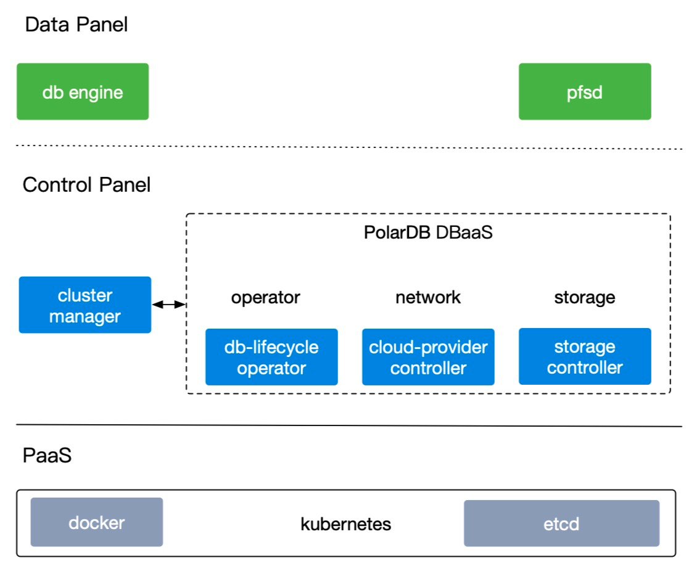
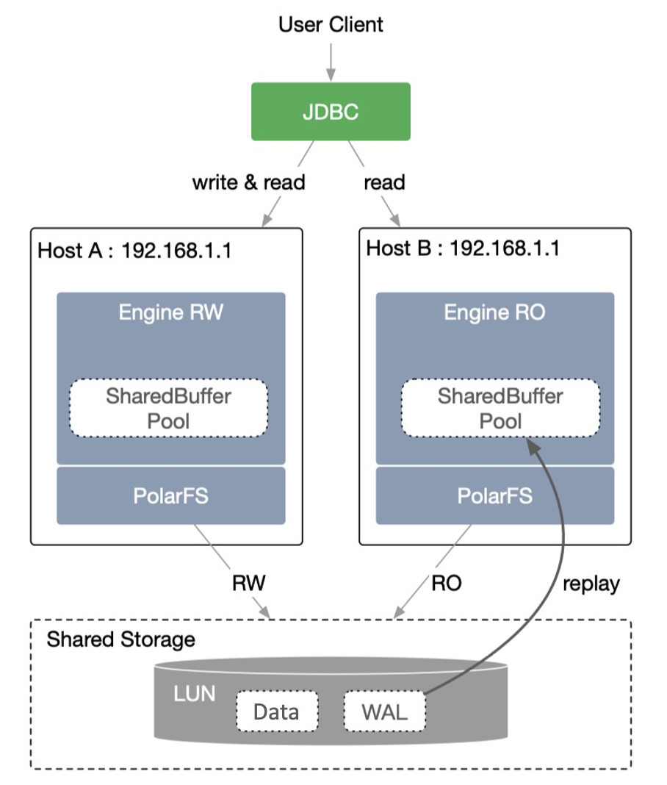
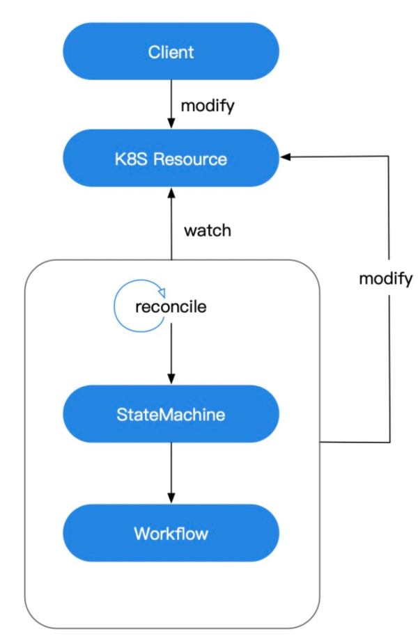
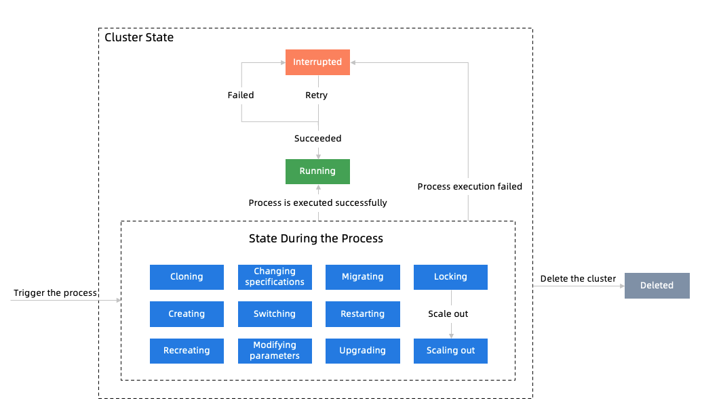

# PolarDB Stack

## Quick Start
[Install Automatically](docs/docs-EN/install_quick-EN.md)

## Install and Use PolarDB Stack
[Install Manually](docs/docs-EN/install-EN.md)

[User Guide](docs/docs-EN/user_manual-EN.md)

## 1 System Overview

PolarDB is a cloud-native relational database independently developed by Alibaba Cloud. It adopts a Shared-Storage-based architecture in which compute is decoupled from storage. The conventional Shared-Nothing architecture is changed to the Shared-Storage architecture for the database. N copies of data in the compute cluster and N copies of data in the storage cluster are changed to N copies of data in the compute cluster and one copy of data in the storage cluster.

PolarDB Stack is a lightweight PaaS software of PolarDB for PostgreSQL. It provides the PolarDB database service sharing storage among the primary node and read-only nodes based on the Shared-Storage architecture. The database lifecycle management is specially customized and deeply optimized in PolarDB Stack.

## 2 Overall Architecture

The cluster components of PolarDB Stack can be divided into three parts: Data Panel, Control Panel, and PaaS.

- Data Panel
  - PolarDB Engine is the database engine that contains the RW (read-write) node, RO (read-only) nodes, and Standby nodes.
  - PolarFS is a user-mode file system.
- Control Panel
  - CM (Cluster Manager) is the cluster management module that supports maintaining the topology of nodes, switching roles of the primary node and read-only nodes, reporting the node status, etc.
  - LifeCycle Operator is responsible for lifecycle management of the database cluster.
  - Storage Controller is responsible for storage management.
  - Daemon is responsible for network management, maintenance inside the node, and status collection.
- PolarDB Stack needs to be deployed on Kubernetes. System components and the database cluster instance run in the Docker container.

## 2.1 Decoupling Compute from Storage

PolarDB Stack adopts the architecture in which compute is decoupled from storage. All compute nodes share one set of data. PolarDB allows you to upgrade or downgrade instance specifications within minutes and perform failovers within seconds. It also ensures global data consistency. PolarDB decouples compute from storage. In this way, you can use automatic scaling to meet the dynamic requirements of your business. All compute nodes share the same underlying physical storage (SAN) by using the distributed file system (PolarFS), which significantly reduces your storage costs.

PolarDB Stack provides the function of decoupling compute from storage for the database engine based on Kubernetes and the shared-storage management controller. To be more specific, PolarDB Stack schedules and allocates the compute resources based on Kubernetes and implements storage mounting and read/write control based on the shared-storage management controller. Applying for and releasing compute resources and upgrading and downgrading instance specifications can be performed independently and flexibly. When you configure compute resources, the storage management controller provides functions such as mounting storage resources and read/write control. All in all, the compute resources and storage resources can be controlled separately and collaborate together.

## 2.2 Lifecycle Management

The lifecycle management of PolarDB Stack for the database cluster mainly includes the following processes: create a database cluster, modify engine parameters, change the specifications, add or remove read-only nodes, expand the storage capacity, migrate nodes, recreate, restart a cluster, restart an instance, switch between the primary node and read-only nodes, upgrade the minor version of the engine, etc.

PolarDB Stack is based on Kubernetes and the lifecycle management function for main component objects is developed based on the Kubernetes operator. The basic workflow is as follows:

Firstly, a Kubernetes resource type needs to be customized. Then users can create or modify an instance of this resource type. When the control operator detects modification on the resource instance, reconciliation will be triggered. During the reconciliation, the state machine detects the current state of the resource, determines whether some action of the current state is triggered, and then executes the action to enter a specific workflow. If the workflow is completed, the instance of this resource type will be in a final (stable) state. As there are many steps in the workflow, executing some of these steps may take a longer time. If some steps fail to be executed, they will be retried automatically. When the number of retries reaches the upper limit, the whole workflow will stop and enter the interrupted state to wait for the manual intervention.

The core task of PolarDB Stack is the lifecycle management of the database cluster. Firstly, the data model of the database cluster needs to be defined based on Kubernetes CRD. Then the operator will focus on the resource changes of the database cluster. When the resource changes occur, the state machine will execute a series of steps according to a specific workflow and finally enter the final state "running" after those steps are executed successfully.

## 2.3 Code Structure

1. In the infrastructure layer, the workflow engine and the tool library are implemented in two projects, respectively.
2. The domain model, API definitions of external dependencies, application service layer, and adapter are implemented in one project by default and used as the domain library.
3. The operator refers to the workflow engine, tool library, and domain library.
4. The workflow instance, REST service, and monitor are implemented in the operator. The implementation of them is simply invoking the workflow engine and the domain library. If the default adapter cannot meet the requirements, you need to implement custom logic for the adapter in the operator.
5. The operator interacts with the application service layer of the domain library to prevent the domain login from being leaked to the application. The operator instantiates the adapter, passes it to the service, and injects it into the domain model.

