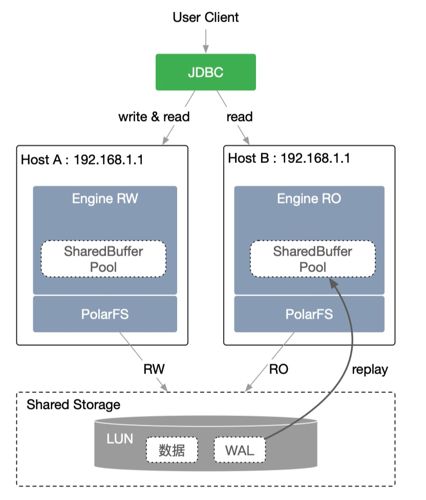
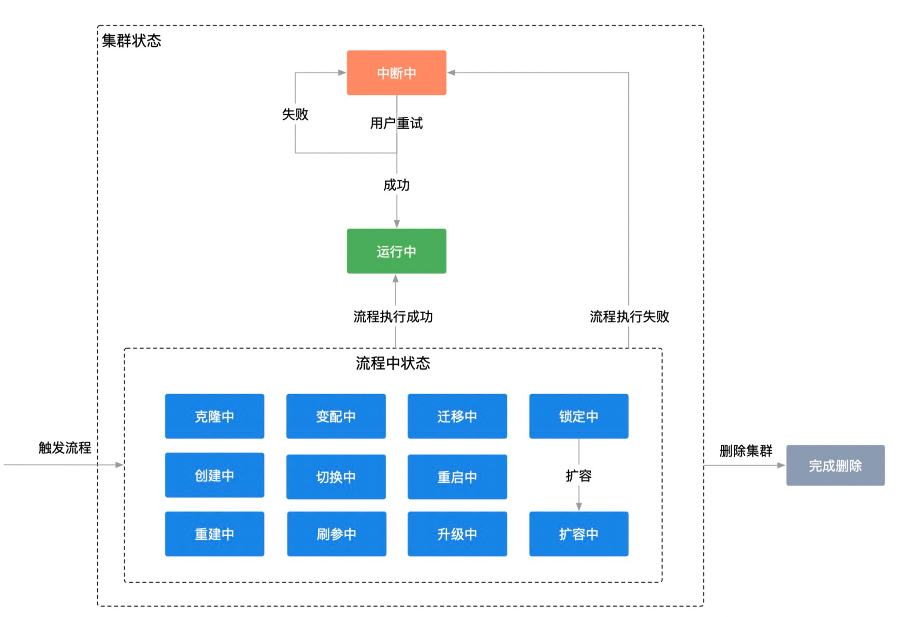
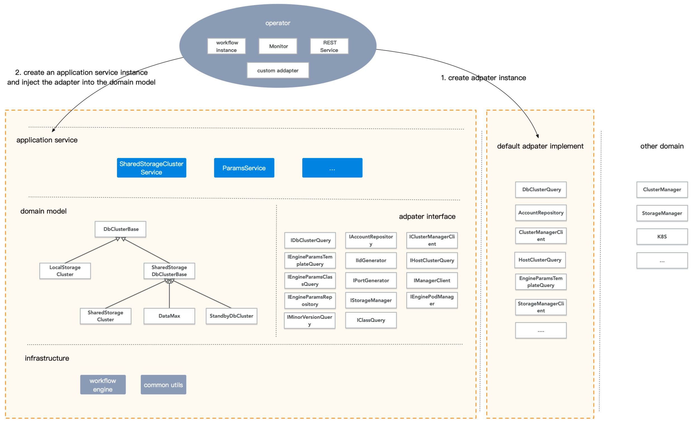

# PolarDB Stack 

## 快速开始
[一键安装](docs/install_quick.md)

## 安装与使用
[安装文档](docs/install.md)

[使用手册](docs/user_manual.md)

## 1 系统概述

PolarDB是阿里云自研的云原生关系型数据库，采用了基于Shared-Storage的存储计算分离架构。数据库由传统的Share-Nothing，转变成了Shared-Storage架构。由原来的N份计算+N份存储，转变成了N份计算+1份存储。

PolarDB Stack是阿里云面向线下数据库市场，推出的轻量级PolarDB PaaS软件。 基于共享存储提供一写多读的PolarDB数据库服务，特别定制和深度优化了数据库生命周期管理。

## 2 整体架构

PolarDB Stack集群组件整体分为Data Panel, Control Panel和Paas三部分。

- 数据面Data Panel

- - PolarDB Engine为数据库引擎，分RW(支持读写)和RO(只读)节点和Standby节点
- PolarFS 用户态文件系统

- 管控面Control Panel

- - CM(Cluster Manager)为集群管理模块，包括节点拓扑维护，主备角色切换，节点状态汇报等
- LifeCycle Operator 负责数据库集群生命周期管理

- - Storage Controller 组件负责存储管理
- Daemon 负责网络管理，节点内部维护、状态采集。

- PolarDB Stack需要部署在Kubernetes上，系统组件及DB集群实例运行在docker容器中

## 2.1 计算存储分离

​     PolarDB Stack采用存储和计算分离的架构，所有计算节点共享一份数据，提供分钟级的配置升降级、秒级的故障恢复、全局数据一致性。采用计算与存储分离的设计理念，满足业务弹性扩展的需求。各计算节点通过分布式文件系统（PolarFS）共享底层的存储（SAN），极大降低了用户的存储成本。PolarDBStack基于kubernetes和共享存储管理控制器为数据库引擎提供计算存储分离功能，基于kubernetes完成计算资源调度与分配，基于共享存储管理控制器完成存储的挂载与读写控制。计算资源申请释放升配降配可灵活独立进行， 在计算资源配置时，存储管理控制器提供存储资源的挂载读写控制等，实现计算资源与存储资源各自分离单独控制与共同协作。

## 2.2 生命周期管理

​     PolarDB Stack数据库集群的生命周期管理主要包括数据库集群创建、刷新引擎参数、规格变更、添加删除节点、存储扩容、迁移节点、重建、重启集群、重启实例、读写切换、引擎小版本升级等流程。

​     PolarDB Stack 使用K8S作为底座，主要组件对象的生命周期管理基于K8S operator开发，基本工作流程如下：首先自定义一种K8S资源，然后由用户创建或修改该资源的一个实例，管控Operator监听到资源实例的变化，触发调协，调协中由状态机检测当前资源状态，判断是否触发了当前状态的某个动作，然后执行该动作进入特定工作流。如果工作流正常执行完毕，资源实例会进入终态（稳态）。由于工作流包含较多步骤，部分动作可能耗时较长，步骤执行失败时会进行重试，自动重试达到上限后，停止继续执行，进入中断状态等待人工介入。

​     数据库集群的生命周期管理是PolarDB Stack核心工作， 首先基于kubernetes CRD定义数据库集群数据模型，然operator会关注DB集群资源变化，资源发生变化时进入状态机，执行特定工作流，一系列步骤执行成功后，最终进入终态“运行中”。

## 2.3 代码架构

1. 基础层的流程引擎、工具库分别抽出一个工程做实现。
2. 领域模型、外部依赖接口定义、应用服务层、适配器默认实现放到同一个工程，作为领域库。
3. operator 引用流程引擎、工具库和领域库。
4. 在operator中实现工作流、REST、monitor，这些逻辑实现很薄，只是对流程引擎和领域库的调用。如果默认适配器不能满足需求，operator还要针对adapter实现自定义逻辑。
5. operator 和领域库的应用服务层交互，防止领域逻辑外泄到应用。operator实例化adapter，并将其传入到service，继而注入到领域模型。

